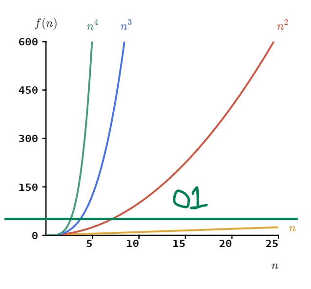

# Big O Notation

[Big O Sorting Algorithm Article](https://builtin.com/machine-learning/fastest-sorting-algorithm)



## types of big O

1. [O(1)](#o-1)
   > - "oh one"
2. [O(n)](#o-n)
   > - "oh n"
3. [O(n^2)](#o-n2)
   > - "oh n two OR oh n squared"
4. [O(log n)](#ologn)
5. [O(n log n)](#o-nlogn)
6. [O(n^3)](#o-n3)
   > - "oh n three OR oh n cubed"

### O(1) algorithms <a id="o-1"></a>

**_Multiply By Two_**

> - [JS Example](./multiply_by_two.js)

> The time complexity of a program that multiplies a single input by two is O(1), which is constant time complexity. This is because the amount of time required to perform the operation remains constant regardless of the input size.

### O(n) algorithms <a id="o-n"></a>

**_Sum of all values_**

> - [JS example](./total_sum.js)
> - [Scratch example](https://scratch.mit.edu/projects/830642600/fullscreen/)

> This program takes an array of numbers as input and calculates the sum of all the numbers in the array. It does this by iterating over each element of the array and adding it to a running total. Since it performs a single operation (addition) for each element in the array, the time complexity of this program is O(n), where n is the number of elements in the array.

**_Maximum Element_**

> - [JS Example](./maximum_element.js)
> - [Scratch Example](https://scratch.mit.edu/projects/830629952/fullscreen/)

> The time complexity of this program is O(n), since we only loop through the array once to find the maximum element.

### O(n^2) algorithms <a id="o-n2"></a>

**_Selection Sort_**

> - [JS Example](./sorting_algorithms/selection_sort.js)

> The time complexity of the selection sort algorithm is O(n^2), where n is the number of elements in the array. This is because the algorithm involves nested loops, where the inner loop has to iterate over the remaining unsorted elements for each element in the outer loop. Therefore, as the number of elements increases, the time required to sort the array increases exponentially.

**_Insertion Sort_**

> - [Insertion Sort](./sorting_algorithms/insertion_sort.js)
> - [Scratch Example](https://scratch.mit.edu/projects/835074666/fullscreen/)
>   The time complexity of the insertion sort algorithm is O(n^2) in the worst case, where n is the number of elements in the array. This is because, in the worst case, for each element in the array, the algorithm may need to shift all of the elements to the right of that element to make space for it in the sorted portion of the array. Therefore, for an array of size n, the algorithm may perform up to n\*n = n^2 comparisons and swaps. However, in the best case, where the array is already sorted, the time complexity is O(n).

**_Bubble Sort_**

> - [JS Example](./sorting_algorithms/bubble_sort.js)

### O (log n) Algorithms <a id="ologn"></a>

**_Binary Search_**

> - [JS Example](./binary_search.js)
> - [Scratch Visualization](https://scratch.mit.edu/projects/834466623/fullscreen/)

> Here's how it works:
>
> 1.  We define the binarySearch function that takes an array arr and a value x as input.
> 2.  We initialize two pointers left and right to the first and last indices of the array, respectively.We enter a loop that continues as long as left is less than or equal to right.
> 3.  We compute the midpoint mid of the array using integer division.If the midpoint value arr[mid] is equal to x, we have found the value we're looking for and return its index mid.
> 4.  If the midpoint value is less than x, we update left to mid + 1 to search the right half of the array. If the midpoint value is greater than x, we update right to mid - 1 to search the left half of the array. If we exit the loop without finding the value, we return -1 to indicate that the value is not in the array. In a binary search algorithm, when we have exhausted the search and the target element is not found in the array, we return -1 to indicate that the element is not present in the array. This is a common convention in many programming languages to indicate the absence of a value or an error condition. It allows the calling function to know that the search was unsuccessful and take appropriate action.

### O (n log n) Algorithms <a id="o-nlogn"></a>

**_Merge Sort_**

> - [JS Example](./sorting_algorithms/merge_sort.js)

> faster than bubble sort  
> usually slower than quick sort

**_Quick Sort_**

- [JS Example](./sorting_algorithms/quick_sort.js)

**_Sort() Method_**

- [JS sort() example](./sorting_algorithms/sort_method.js)

> A simple javascript method that is similar in execution to a bubble sort

**_Heap Sort_**

> - [JS Example](./sorting_algorithms/heap_sort.js)

### O(n^3) Algorithms <a id="o-n3"></a>

**_Maximum Product of Triplets_**

> - [JS Example](./maximum_product.js)

> This algorithm has three nested loops, which means it takes O(n^3) time to execute, where n is the length of the input array. The algorithm computes the product of all possible triplets of elements from the array, and returns the maximum product. In the example usage, the algorithm is applied to an array of length 5, and returns the maximum product of any triplet of elements, which is 60.

```console
i = 0, j = 1, k = 2, arr[i] = 1, arr[j] = 2, arr[k] = 3, product = 6
i = 0, j = 1, k = 3, arr[i] = 1, arr[j] = 2, arr[k] = 4, product = 8
i = 0, j = 1, k = 4, arr[i] = 1, arr[j] = 2, arr[k] = 5, product = 10
i = 0, j = 2, k = 3, arr[i] = 1, arr[j] = 3, arr[k] = 4, product = 12
i = 0, j = 2, k = 4, arr[i] = 1, arr[j] = 3, arr[k] = 5, product = 15
i = 0, j = 3, k = 4, arr[i] = 1, arr[j] = 4, arr[k] = 5, product = 20
i = 1, j = 2, k = 3, arr[i] = 2, arr[j] = 3, arr[k] = 4, product = 24
i = 1, j = 2, k = 4, arr[i] = 2, arr[j] = 3, arr[k] = 5, product = 30
i = 1, j = 3, k = 4, arr[i] = 2, arr[j] = 4, arr[k] = 5, product = 40
i = 2, j = 3, k = 4, arr[i] = 3, arr[j] = 4, arr[k] = 5, product = 60
```

# Array Sorting Videos

[15 algorithms in 6 min](https://www.youtube.com/watch?v=kPRA0W1kECg)

- bubble sort starts at 4:00
